# Hubitat Alarm

Hubitat Alarm is a solution to integrate [DSC (IT-100 or Envisalink)](https://www.dsc.com/) or [Honeywell (Envisalink)](https://www.honeywellhome.com/) alarm system to Hubitat Elevation. It will allow you to control your home alarm (DSC or Honeywell) using Hubitat from everywhere. It's compatible with HSM (Hubitat Safety Monitor) you can ARM, Disarm all modes using HSM, Rule Machine or any other automation.

You can also build your own Alarm dashboard:
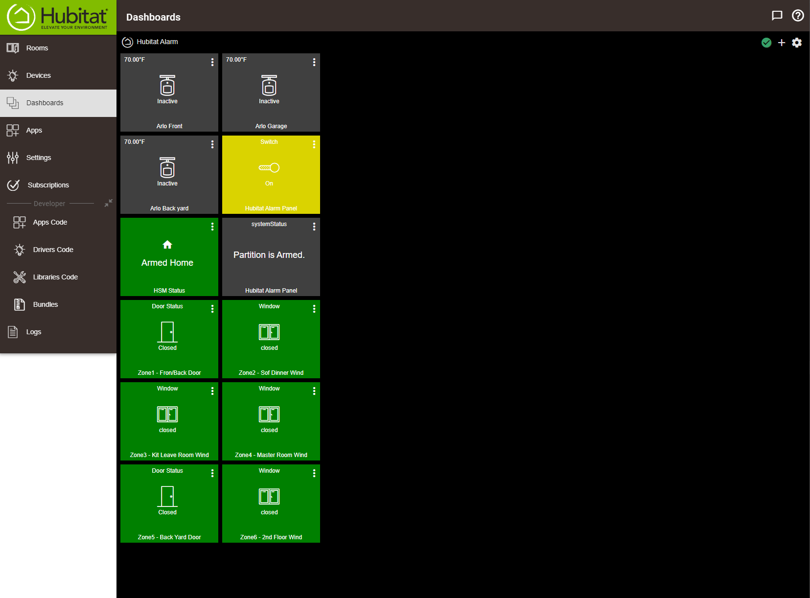

Hubitat Alarm is all in one solution with the following features:

- Easy deployment and management

- Auto mapping Alarm Zones to device Types

- Compatible with Serial board [DSC-IT100](https://www.amazon.com/Tyco-Serial-Integration-Module-Control/dp/B003XACL9C/ref=sr_1_1_sspa?keywords=dsc-it100&qid=1638610345&sr=8-1-spons&psc=1&spLa=ZW5jcnlwdGVkUXVhbGlmaWVyPUEzNzY4U0pUMkpXUUdWJmVuY3J5cHRlZElkPUEwMTk2ODMxMzZFQlE4MkVPV01GOSZlbmNyeXB0ZWRBZElkPUExMDExMTEzVjJCODg2VVNQNFpKJndpZGdldE5hbWU9c3BfYXRmJmFjdGlvbj1jbGlja1JlZGlyZWN0JmRvTm90TG9nQ2xpY2s9dHJ1ZQ==) or [Envisalink](https://www.amazon.com/Envisalink-EVL-4EZR-Interface-Honeywell-Compatible/dp/B016WQTJ4S/ref=sr_1_3?keywords=envisalink+dsc&qid=1638610590&sr=8-3). In case of DSC alarm you can chose the one you are using. Honeywell is only compatible with Envisalink.

- Backup and Restore, you can restore either the Raspberry Pi or Hubitat Alarm app settings.

- Supports two communication methods WSS or API

- Installation available using Hubitat Package Manager

- Raspberry Pi deployment using docker or installation script

## DSC Alarm

### **DSC with IT-100**

IT-100 is a serial board (RS-232) that can be integrated with DSC Alarm system. It implement an interface to interact with DSC main Alarm board by sending/receiving commands. [Detailed information.](./Documentation/DSC-it100.pdf)

### **DSC with Envisalink**

- Envisalink is a Ethernet board that can be integrated with DSC Alarm system. It implement an interface to interact with DSC main Alarm board by sending/receiving commands. [Detailed information.](./Documentation/EnvisaLinkTPI-ADEMCO-1-03.pdf)

## Honeywell Alarm

### **Honeywell with Envisalink**

- Envisalink is a Ethernet board that can be integrated with Honeywell alarm. It implement an interface to interact with Honeywell main Alarm board by sending/receiving commands. [Detailed information.](./Documentation/EnvisaLinkTPI-ADEMCO-1-03.pdf)

## Connectivity

Hubitat Alarm was build to run in a single board compute like Raspberry Pi. There are many possible options to connect Hubitat Alarm to your home alarm (DSC or Honeywell) using a Raspberry Pi. Here is a list of possible options:

- DSC IT-100, can be connected to a Raspberry Pi 3 or Zero W using a USB to Serial cable. The Raspberry Pi 3 can connect to your network using either WiFi of Ethernet cable. For Raspberry Pi Zero W you can connect to your network using WiFi only.
- Envisalink, requires a Ethernet connection to access your network and Raspberry Pi would access the Envisalink IP address using your local network.

Connection logic:


## Hubitat Alarm technical details

Hubitat Alarm is a Node.JS application that works like a bridge between DSC or Honeywell alarms to Hubitat HUB. It will detect all events in the alarm and will communicate with Hubitat application.

It supports either DSC-IT100 or Envisalink to connect to DSC or Honeywell alarms.

The communication between Hubitat app and Hubitat Alarm can be configured in two possible ways:

- Web Sockets - This is the preferred way to connect Hubitat App to Hubitat Alarm. A web socket session will be established and will remain open sending and receiving commands working as a live bridge.
- API - This is a push and pull model where Hubitat App will consume use APIs request to send and receive commands.

### Setup Hubitat Alarm

There are two methods to install Hubitat Alarm to a Raspberry Pi. It can be installed using a script or docker container.

#### Script Installation method

To install Hubitat Alarm in your Raspberry Pi using script just copy and paste the following command line:

```bash
curl -SL https://raw.githubusercontent.com/Welasco/HubitatAlarm/master/Alarm/install.sh | sudo -E bash -
```

To update just run the same command again. It will detect if it was already installed and update to the latest version.
Hubitat Alarm will be installed under this path: /opt/Alarm. It will create a config.json file that should be backup to preserve all your settings.

To uninstall run the following command:

```bash
curl -SL https://raw.githubusercontent.com/Welasco/HubitatAlarm/master/Alarm/uninstall.sh | sudo -E bash -
```

#### Docker method

You must have Docker installed. You can use the following commands to install Docker in your Raspberry Pi.

```bash
sudo curl -sL get.docker.com | bash
sudo usermod -a -G docker pi
```

Run Hubitat Alarm container using the following command:

- For DSC-IT100

```bash
docker run --name=hubitatalarm -d -p 3000:3000 -v /home/pi/hubitatalarmConfig:/opt/Alarm/config --device=/dev/ttyUSB0 --restart always welasco/hubitatalarm:latest
```

- For Envisalink

```bash
docker run --name=hubitatalarm -d -p 3000:3000 -v /home/pi/hubitatalarmConfig:/opt/Alarm/config --restart always welasco/hubitatalarm:latest
```

Hubitat Alarm will create a config.json file in the mounted folder /home/pi/hubitatalarmConfig. It's important to keep this file out of the container in case you have to update or reinstall the container.

To update a container you run the following commands:

```bash
# Updating Alarm conatiner
docker pull welasco/hubitatalarm:latest
docker stop hubitatalarm
docker rm hubitatalarm
# Run command for DSC-IT100
docker run --name=hubitatalarm -d -p 3000:3000 -v /home/pi/hubitatalarmConfig:/opt/Alarm/config --device=/dev/ttyUSB0 --restart always welasco/hubitatalarm:latest
# Run command for Envisalink
docker run --name=hubitatalarm -d -p 3000:3000 -v /home/pi/hubitatalarmConfig:/opt/Alarm/config --restart always welasco/hubitatalarm:latest
```

## Installing Hubitat App in your HUB

The Hubitat App consist in two files the App [HubitatAlarmApp.groovy](./Hubitat/HubitatAlarmApp.groovy) and the driver [HubitatAlarmPanel.groovy](./Hubitat/HubitatAlarmPanel.groovy). You can manually download both [App](https://docs.hubitat.com/index.php?title=How_to_Install_Custom_Apps) and the [driver](https://docs.hubitat.com/index.php?title=How_to_Install_Custom_Drivers) and install using the respective instructions steps. I recommend the installation to be done using [Hubitat Package Manager](https://github.com/dcmeglio/hubitat-packagemanager) it's easier and has an update process to keep the code always updated.

### Installing Hubitat Alarm code using Hubitat Package Manager

In case you don't have Hubitat Package Manager installed yet you can follow the instructions [here](https://github.com/dcmeglio/hubitat-packagemanager) to get it installed.

- Go to Apps and open Hubitat Package Manager and click Install
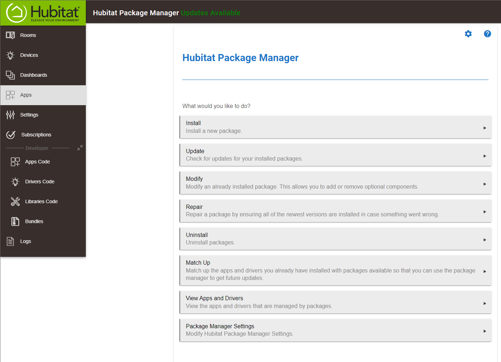

- Click Search by Keywords
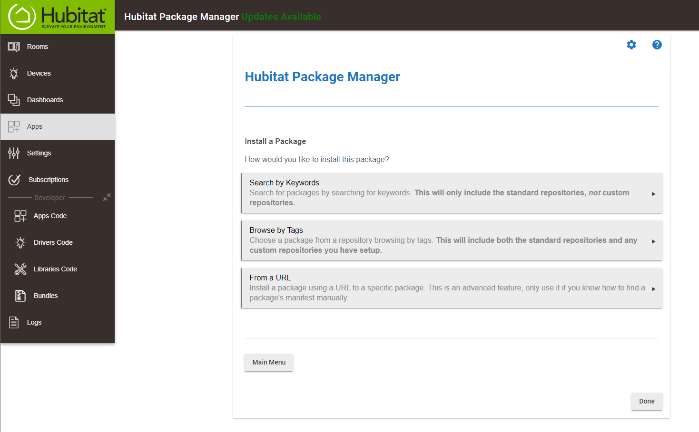

- Type Hubitat Alarm, click Next
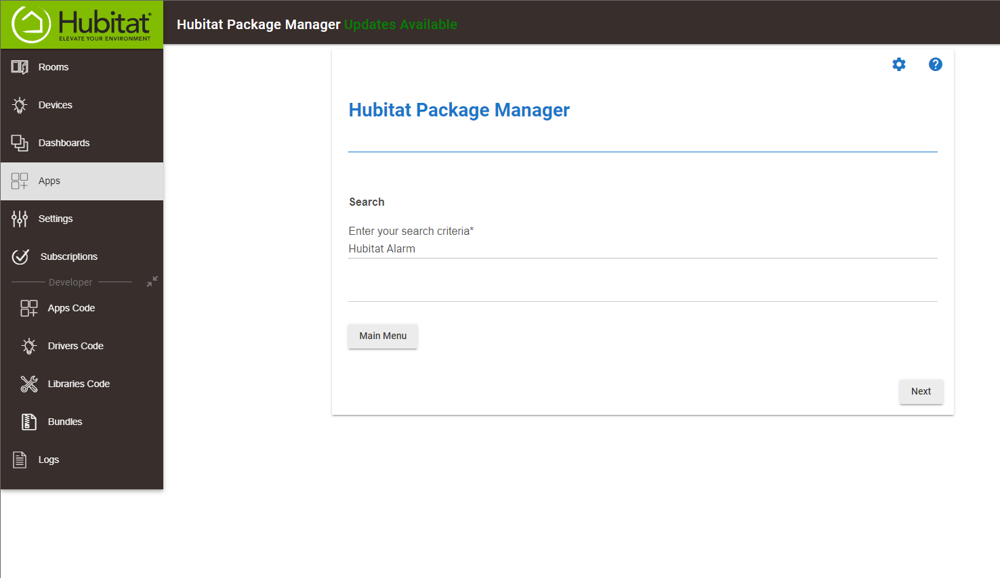

- Look for Hubitat Alarm by Victor Santana
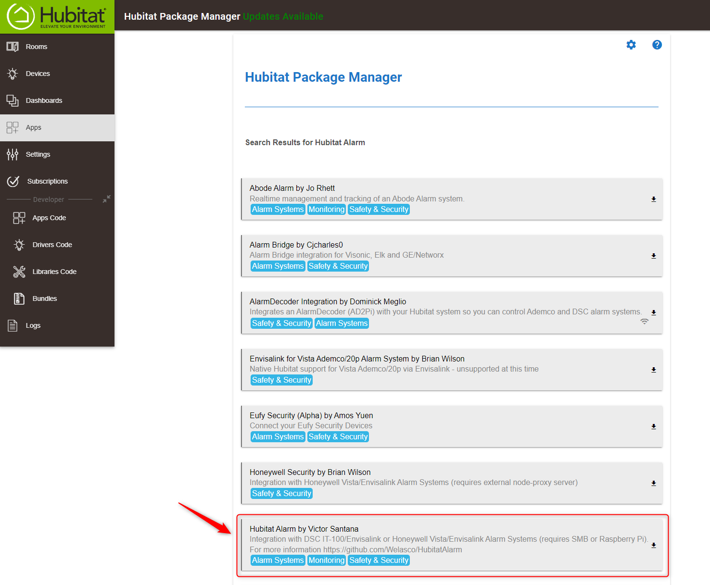

- In Ready to Install click Next
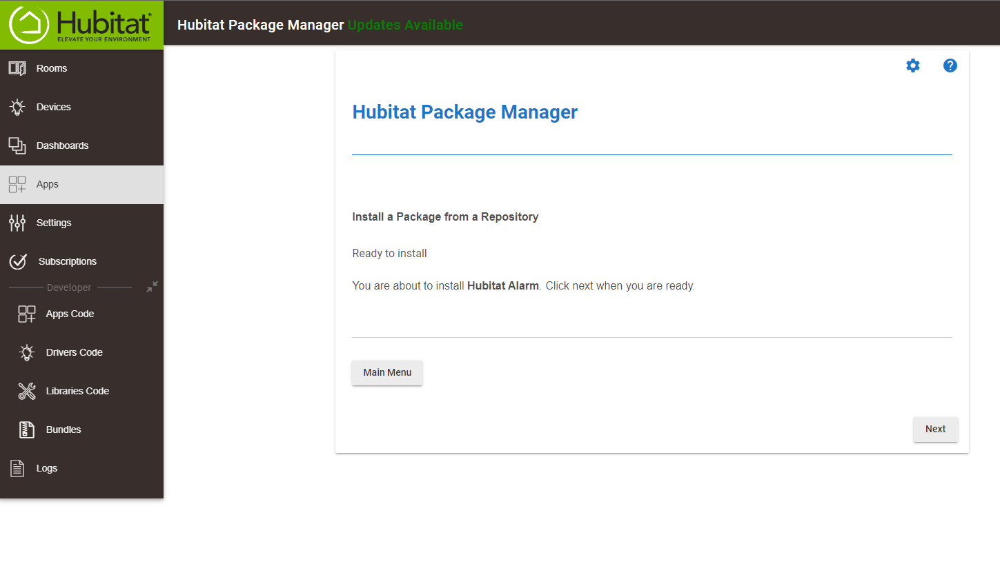

### Installing Hubitat Alarm app

After you have installed the code using Hubitat Package Manager it's the time to install the App

- Go to Apps and click Add User App top right corner


- Click in Hubitat Alarm
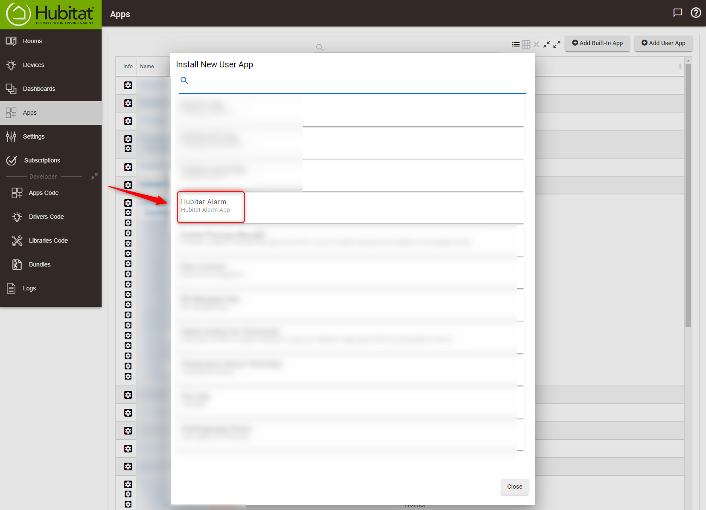

- In case you have been using Hubitat Alarm before you can restore the settings from a previous Raspberry Pi. Hubitat Alarm will contact the API and reload all your settings.
If that's your first time follow the regular installation process.

- In Hubitat Alarm settings fill up the entire form. Add the Raspberry Pi IP address in Alarm Address field. By default it will be running on Port 3000. Add your alarm code in Alarm Security Code. Chose the communication method WSS/API, the proffered method is WSS. Choose your alarm type (DSC/Honeywell) in case you are using DSC select the board type DSC-IT100 (by default use /dev/ttyUSB0 for the USB to serial adapter) or Envisalink (requires the IP address and code of Envisalink. Default code is user). In case you would like to install and use Hubitat Home Monitor keep the Integrated option enabled. Click Configure Alarm Zones settings.

- DSC IT-100
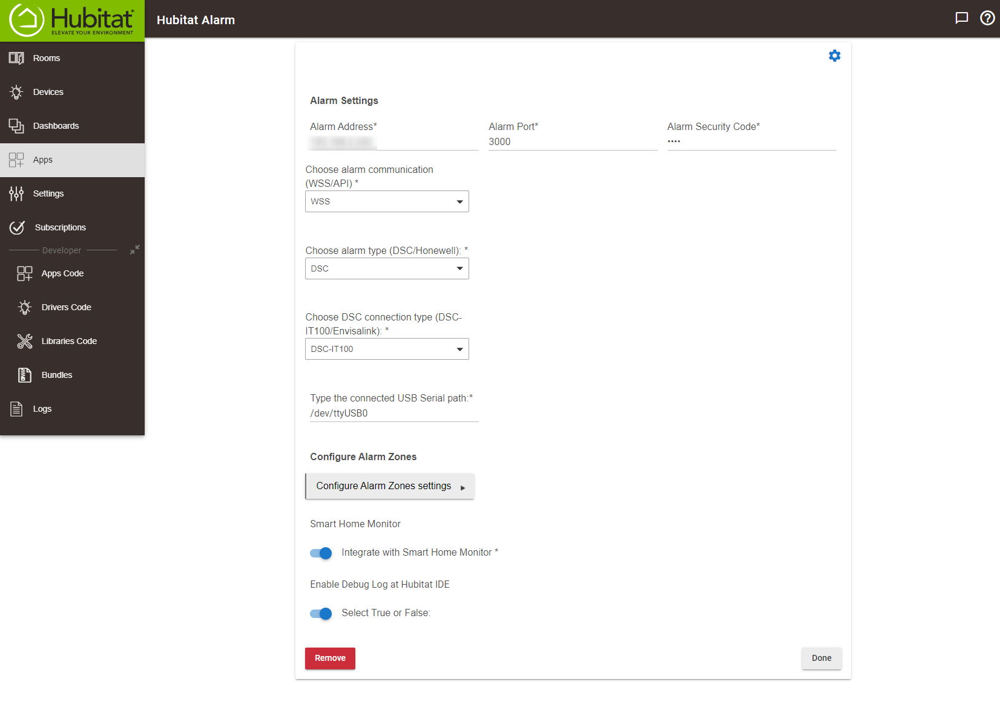

- DSC Envisalink
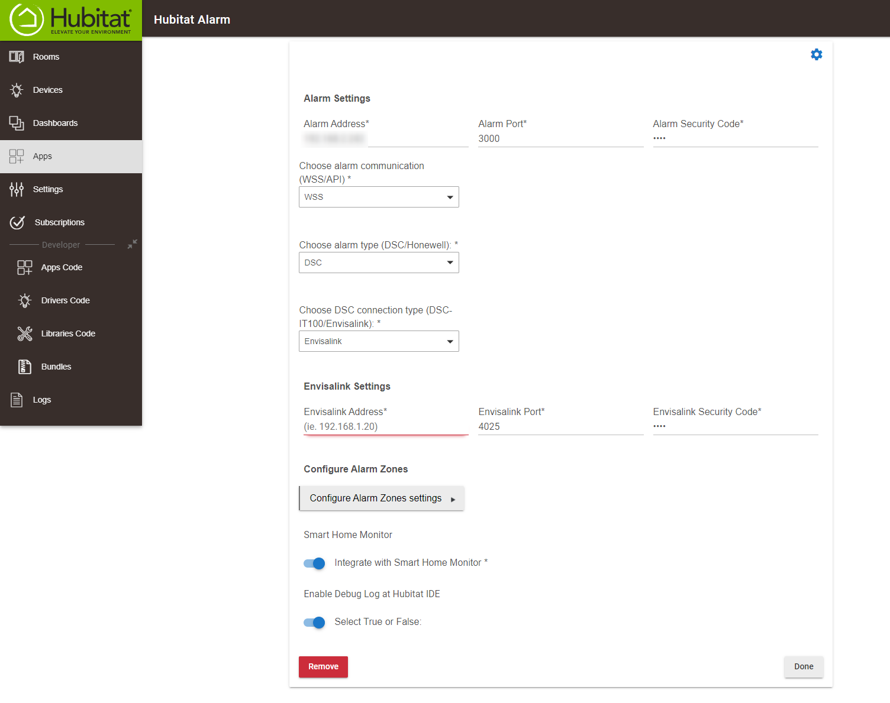

- Honeywell Envisalink
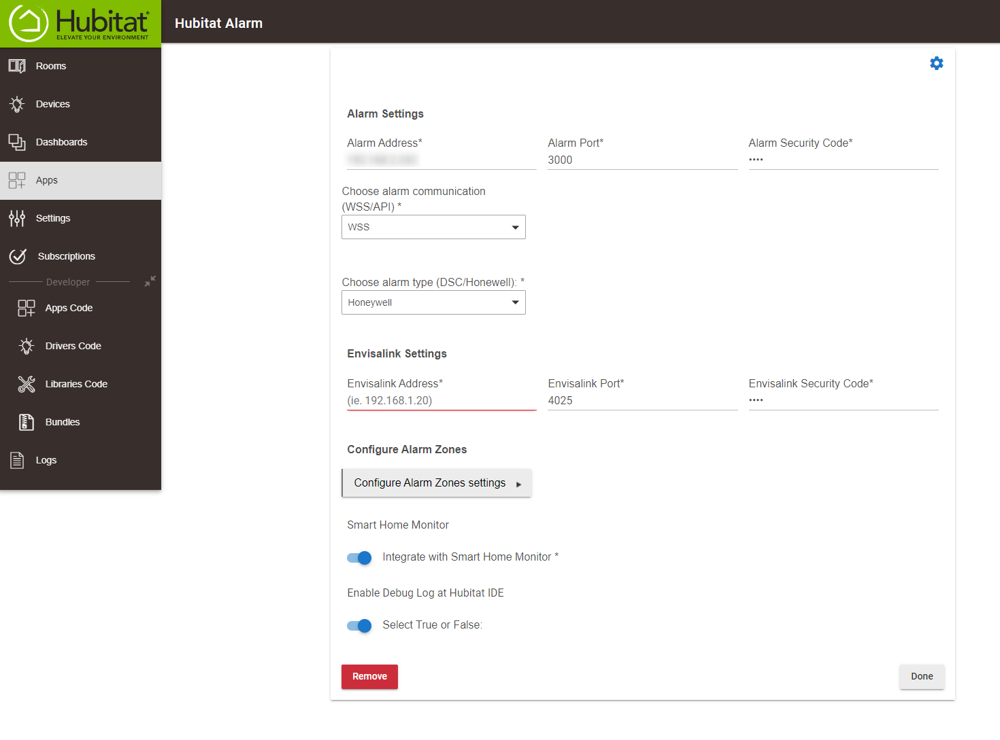

- Configure the Alarm Zones settings. Add how many zones you have setup in your alarm and add zoneid, Zone Name and select tye Zone Type.
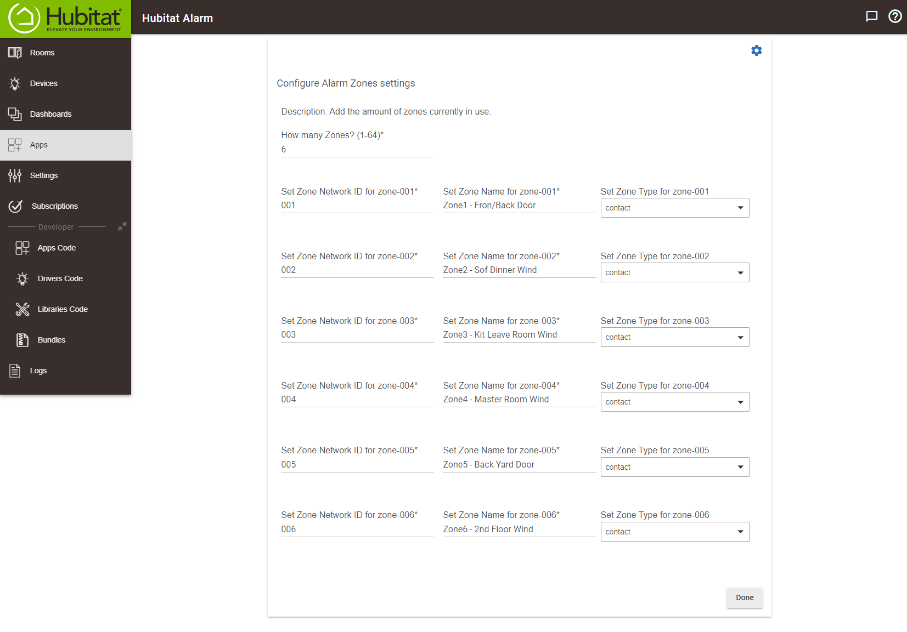

- Save all settings and click done. You will see the Hubitat Alarm app installed.
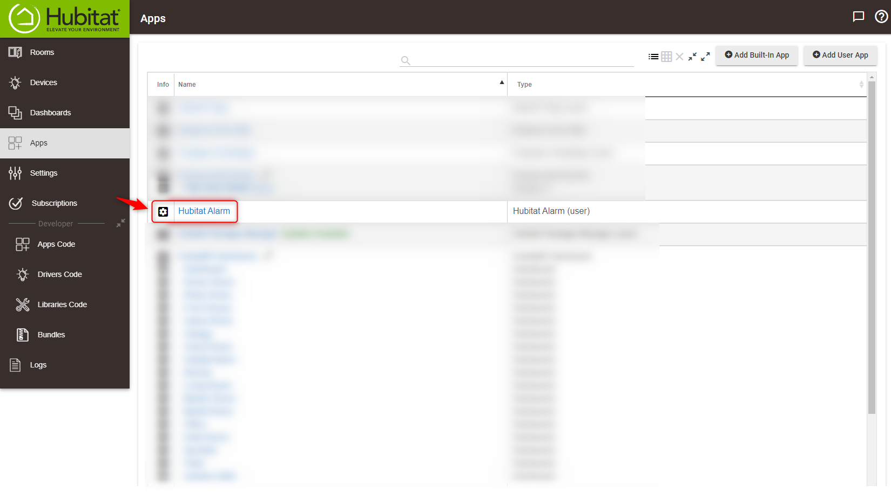

- You can go to Devices and see the Hubitat Alarm Panel and Zones device. Click in Hubitat Alarm Panel
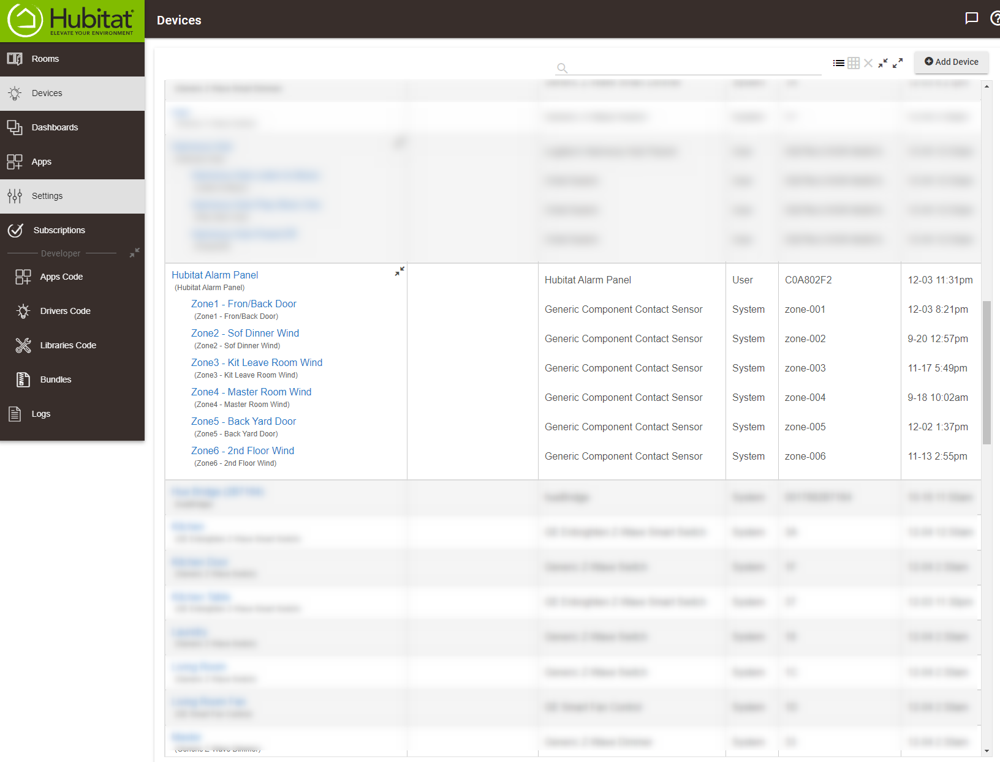

- You can control the alarm using the Panel or Hubitat Safety Monitor.
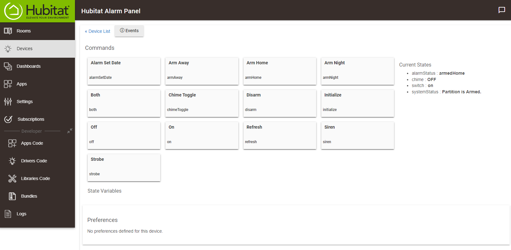

- You can also build your own Dashboard


### Using Hubitat Safety Monitor

Hubitat Alarm is compatible with Hubitat Safety Monitor. You can install Hubitat Safe Monitor from a Built-in App and configure as follow.

- Go to Apps and open HSM
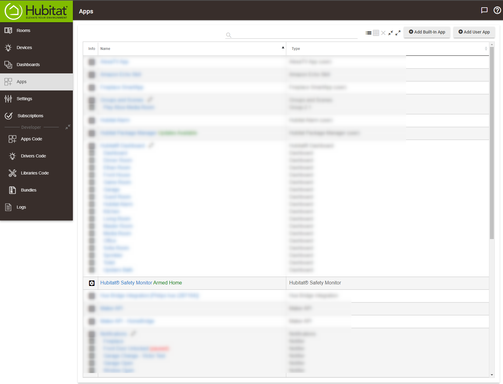

- Click in Configure Hubitat Safety Monitor and setup HSM using your preferred settings. You can ARM and Disarm the alarm using HSM.
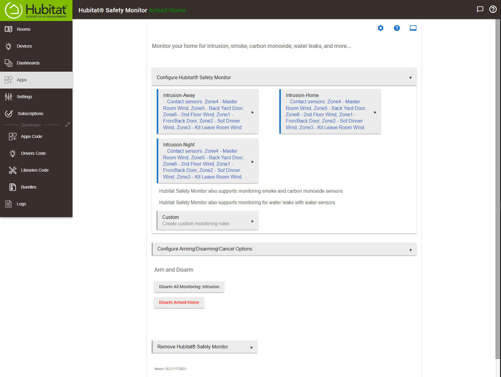